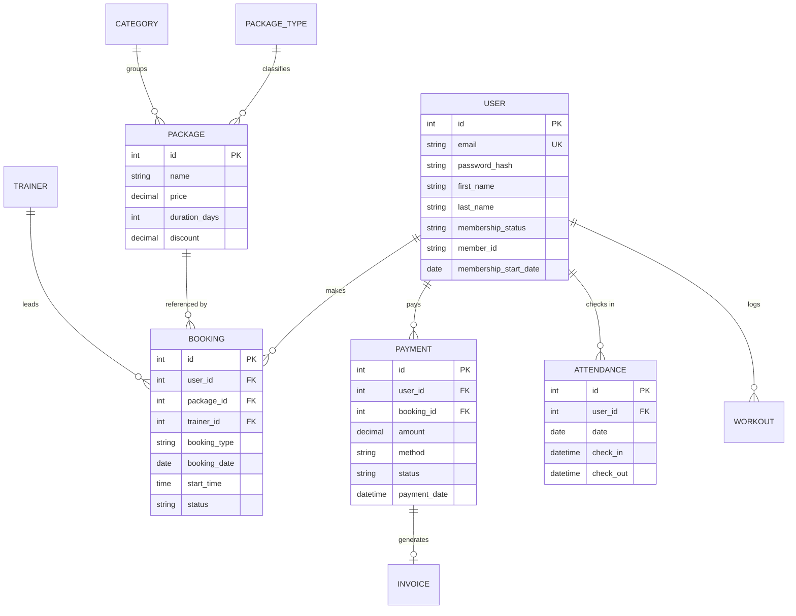

# 📋 PROJECT REPORT
## Fitness First Gym — Gym Management System

---

## 1. Certificate of Completion

```
CERTIFICATE OF COMPLETION

This is to certify that the project titled

        "FITNESS FIRST GYM — GYM MANAGEMENT SYSTEM"

has been successfully designed, developed, tested, and deployed as a fully
functional web-based application.

The system provides complete management of a modern gymnasium including
member registration, membership packages, trainers, class bookings, payment
tracking, attendance, workout & fitness tracking, and administrative reports.

Technology: Django REST Framework (backend) · React + TypeScript (frontend)
Database:  PostgreSQL (Supabase) · Deployment: Render + Vercel

The project is LIVE and verified end-to-end:

    Frontend:  https://gym-management-system-iota-five.vercel.app
    Backend:   https://fitness-first-gym-backend.onrender.com

Date: August 2026
```

---

## 2. Table of Contents

1. Certificate of Completion
2. Table of Contents
3. Problem Definition
4. Customer Requirement Specification
5. Project Plan
6. E-R Diagrams
7. Algorithms
8. GUI Standards Document
9. Interface Design Document
10. Task Sheet
11. Project Review and Monitoring Report
12. Unit Testing Check List
13. Final Check List

---

## 3. Problem Definition

### 3.1 Background
A small-to-medium fitness gym currently manages its members, membership
packages, class bookings, and payments using **paper records and spreadsheets**.
This manual approach creates several operational problems.

### 3.2 The Problem
- **Data loss & errors:** Manual records are prone to being misplaced, and data
  entry errors are common.
- **No central member records:** It is difficult to track member details,
  membership start/end dates, renewals, and status.
- **Difficult payment tracking:** Revenue is recorded inconsistently; it is hard
  to know monthly income, who has paid, and who is in arrears.
- **Inefficient booking management:** Members cannot self-serve to book classes;
  staff spend time coordinating schedules on paper.
- **No reporting:** Management cannot easily generate reports on revenue,
  members, attendance, or bookings.
- **No member self-service:** Members cannot view their own history, update
  their profile, or change their password without contacting staff.

### 3.3 Aim
To develop an integrated web-based Gym Management System that centralizes
member, package, booking, payment, attendance, and fitness data in one secure
platform with role-based access for guests, members, and administrators.

### 3.4 Objectives
1. Provide a public website with information about the gym, trainers, equipment,
   and packages.
2. Enable members to register, log in, update their profile, and change their
   password.
3. Allow members to view their booking history and payment details.
4. Provide an admin dashboard with an overview of revenue, members, bookings,
   packages, categories, and package types.
5. Enable admins to manage categories, package types, packages, bookings, and
   payments.
6. Generate date-range reports for bookings and registered users.
7. Provide workout & fitness tracking tools.
8. Deploy the system live on a free, scalable hosting stack.

---

## 4. Customer Requirement Specification (CRS)

### 4.1 Functional Requirements

**FR-1 — Guest Users**
- FR-1.1: Guest can view the website and gym information.
- FR-1.2: Guest can submit an inquiry through the Contact Us page.
- FR-1.3: Guest can view trainers, equipment, packages, and categories.

**FR-2 — Registered Users (Members)**
- FR-2.1: Registration — one-time registration required to apply for a package.
- FR-2.2: Login — member logs in to access the dashboard.
- FR-2.3: Booking History — view booked packages and payment details.
- FR-2.4: Profile — update personal information.
- FR-2.5: Change Password — change own password.

**FR-3 — Admin**
- FR-3.1: Login through the login page.
- FR-3.2: Dashboard — overview of bookings, packages, categories, package types.
- FR-3.3: Categories — add and delete categories.
- FR-3.4: Package-Type — add and delete package types.
- FR-3.5: Packages — add and edit packages.
- FR-3.6: Bookings — view new bookings and partial/full payment bookings;
  update payment details against a booking.
- FR-3.7: Report — generate between-dates reports for bookings and users.
- FR-3.8: Update profile, change password, recover password.

### 4.2 Non-Functional Requirements

- **NFR-1 Security:** Passwords hashed; JWT-based authentication; role-based
  access control; `.env` secrets not committed.
- **NFR-2 Performance:** Fast page loads; responsive UI; paginated API lists.
- **NFR-3 Usability:** Vercel-inspired minimal UI; consistent light and dark
  themes; accessible focus states.
- **NFR-4 Reliability:** Data persists in PostgreSQL (Supabase); auto-migrations
  at deploy.
- **NFR-5 Maintainability:** Clean separation of Django apps; typed React;
  centralized design tokens.
- **NFR-6 Availability:** Deployed on Render + Vercel free tiers.

---

## 5. Project Plan

### 5.1 Phases

| Phase | Description | Deliverable |
|---|---|---|
| 1. Analysis | Requirement gathering, gap analysis | CRS document |
| 2. Database Design | Models & relationships | E-R Diagram |
| 3. Backend Development | Django REST API, auth, apps | API endpoints |
| 4. Frontend Development | React pages, design system | User interface |
| 5. Integration | Connect frontend ↔ backend | Working app |
| 6. Testing | Unit + end-to-end testing | Test report |
| 7. Deployment | Render + Supabase + Vercel | Live application |
| 8. Documentation | Project report | This document |

### 5.2 Timeline

| Milestone | Estimate |
|---|---|
| Analysis & design | 1 week |
| Backend APIs | 2 weeks |
| Frontend UI | 2 weeks |
| Testing | 1 week |
| Deployment | 2 days |
| Documentation | 1 day |

### 5.3 Resources
- **Tools:** VS Code, Git, GitHub, Render, Supabase, Vercel, PostgreSQL 18
- **Languages:** Python 3.11, TypeScript, SQL
- **Frameworks:** Django 5, DRF 3.17, React 19, Vite, Tailwind CSS 4

---

## 6. E-R Diagrams

### 6.1 Entity-Relationship Model (entities & relationships)

Below is the logical ER model of the core entities.



### 6.2 Entity Descriptions

**User** — members and admins. Holds profile info, membership status,
membership dates, and a unique member ID.

**Package** — membership offerings. Attributes: name, price, duration, discount,
benefits. Belongs to one **Category** and one **PackageType**.

**Category** — program area (Cardio, Strength, Yoga).

**PackageType** — duration class (Monthly, Quarterly, Annual).

**Trainer** — gym coach with specialization, experience, photo.

**Booking** — a session booking by a user, optionally tied to a package/trainer.

**Payment** — a financial transaction by a user against a booking/package.

**Invoice** — a bill generated from a payment.

**Attendance** — daily check-in/check-out record per member.

**Workout** — member-logged workout with exercises and sets.

---

## 7. Algorithms

### 7.1 User Authentication (JWT)

```
ALGORITHM login(email, password):
    user = find_user_by_email(email)
    if user is None: return "Invalid credentials"
    if NOT verify_password(password, user.password_hash): return "Invalid credentials"
    access_token  = sign_jwt(user.id, 'access',  2h)
    refresh_token = sign_jwt(user.id, 'refresh', 7d)
    return { access_token, refresh_token }
```

### 7.2 Payment / Revenue Computation (Dashboard)

```
ALGORITHM dashboard_revenue():
    today = now()
    first_of_month = today.replace(day=1)
    monthly = SUM(amount) WHERE status='paid' AND payment_date >= first_of_month
    total   = SUM(amount) WHERE status='paid'
    return { monthly_revenue: monthly, total_revenue: total }
```

### 7.3 Booking Ownership & Status

```
ALGORITHM list_bookings(user):
    if user.is_staff:
        return ALL bookings
    else:
        return bookings WHERE user = user        // ownership enforced

ALGORITHM update_booking(booking, new_status, user):
    if user.is_staff:
        booking.status = new_status; booking.save()
    else if booking.user == user and new_status == 'cancelled':
        booking.status = 'cancelled'; booking.save()
    else:
        return PermissionError
```

### 7.4 Discounted Price

```
ALGORITHM discounted_price(package):
    return package.price * (1 - package.discount / 100)
```

### 7.5 Check-in / Check-out (Attendance)

```
ALGORITHM check_in(user):
    if exists attendance(user, today): return "Already checked in"
    create attendance(user, date=today, check_in=now)

ALGORITHM check_out(user):
    record = latest attendance(user, today, check_out IS NULL)
    if record is None: return "No active check-in"
    record.check_out = now; record.save()
```

### 7.6 Report Export (CSV)

```
ALGORITHM export_report(type, start_date, end_date):
    rows = query_rows(type, start_date, end_date)
    return csv(rows)   // streamed to client
```

---

## 8. GUI Standards Document

### 8.1 Design Philosophy
Inspired by the **Vercel** design system: minimal, elegant, premium. Neutral
monochrome surfaces with a refined indigo accent.

### 8.2 Color Palette

| Token | Light | Dark |
|---|---|---|
| Background | `#ffffff` | `#0a0a0a` |
| Foreground | `#171717` | `#f6f6f5` |
| Accent (primary) | `#4b59e0` | `#7c93ff` |
| Border | `#e8e8e6` | `#292929` |
| Muted text | `#85857f` | `#b5b5b0` |

### 8.3 Typography
- Font: **Inter** (sans-serif)
- Headings: weight 600, letter-spacing -0.025em
- Body: 0.9375rem, line-height 1.6

### 8.4 Buttons
- Default: filled dark button (charcoal-950), white text
- Outline: transparent with border
- Premium: primary gradient for featured actions
- Loading state shows a spinner

### 8.5 Cards
- Rounded corners (`rounded-lg`), subtle border, soft layered shadow
- Consistent padding (`p-5`)

### 8.6 Accessibility
- Focus-visible ring in primary color
- Semantic HTML, ARIA on interactive components
- Dark mode uses `.dark` class variant; seamless switching

### 8.7 Responsive
- Mobile-first grids (`grid-cols-1 md:grid-cols-2 lg:grid-cols-3 xl:grid-cols-6`)
- Collapsible sidebar, mobile drawer navigation

---

## 9. Interface Design Document

### 9.1 Public Pages
| Page | Route | Purpose |
|---|---|---|
| Home | `/` | Hero, intro |
| About | `/about` | Gym info |
| Membership | `/membership` | Packages & pricing |
| Categories | `/categories` | Program categories |
| Package Types | `/package-types` | Duration types |
| Trainers | `/trainers` | Trainer profiles |
| Equipment | `/equipment` | Gym equipment |
| Contact | `/contact` | Inquiry form |
| FAQ | `/faq` | Questions |
| BMI | `/bmi` | BMI calculator |

### 9.2 Auth Pages
| Page | Route |
|---|---|
| Login | `/login` |
| Register | `/register` |
| Forgot Password | `/forgot-password` |

### 9.3 Dashboard — Admin
| Page | Route |
|---|---|
| Overview | `/dashboard` |
| Members | `/dashboard/members` |
| Trainers | `/dashboard/trainers` |
| Packages | `/dashboard/packages` |
| Bookings | `/dashboard/bookings` |
| Payments | `/dashboard/payments` |
| Attendance | `/dashboard/attendance` |
| Equipment | `/dashboard/equipment` |
| Reports | `/dashboard/reports` |
| Analytics | `/dashboard/analytics` |
| Profile | `/dashboard/profile` |
| Settings | `/dashboard/settings` |

### 9.4 Dashboard — Member
| Page | Route |
|---|---|
| Member Home | `/dashboard/member` |
| My Packages | `/dashboard/member/packages` |
| My Bookings | `/dashboard/member/bookings` |
| My Payments | `/dashboard/member/payments` |
| Workouts, Progress, Records, Measurements | `/dashboard/workouts` … |
| My Profile | `/dashboard/profile` |

### 9.5 API (REST) Endpoints
| Method | Endpoint | Purpose |
|---|---|---|
| POST | `/api/token/` | Login (JWT) |
| POST | `/api/auth/register/` | Register member |
| GET | `/api/packages/` | List packages |
| GET | `/api/trainers/` | List trainers |
| GET | `/api/equipment/` | List equipment |
| GET/POST | `/api/bookings/` | List/create bookings |
| GET | `/api/payments/` | List payments |
| POST | `/api/attendance/check-in/` | Check-in |
| GET | `/api/dashboard/stats/` | Dashboard stats |
| GET | `/api/dashboard/reports/export/` | CSV report |

---

## 10. Task Sheet

| No. | Task | Owner | Status |
|---|---|---|---|
| 1 | Requirement analysis & gap analysis | Team | ✅ |
| 2 | Backend project scaffolding (Django) | Dev | ✅ |
| 3 | User model & JWT auth | Dev | ✅ |
| 4 | Packages / categories / types APIs | Dev | ✅ |
| 5 | Trainers / equipment / bookings APIs | Dev | ✅ |
| 6 | Payments / attendance / notifications APIs | Dev | ✅ |
| 7 | Workout & fitness-tracking APIs | Dev | ✅ |
| 8 | Analytics & report endpoints | Dev | ✅ |
| 9 | Frontend design system (Tailwind v4) | Dev | ✅ |
| 10 | Public pages | Dev | ✅ |
| 11 | Auth pages | Dev | ✅ |
| 12 | Admin dashboard pages | Dev | ✅ |
| 13 | Member dashboard pages | Dev | ✅ |
| 14 | Dark mode theming | Dev | ✅ |
| 15 | Media wiring & image display | Dev | ✅ |
| 16 | Currency switch to USD | Dev | ✅ |
| 17 | Data seeding (trainers, packages, revenue) | Dev | ✅ |
| 18 | PostgreSQL migration | Dev | ✅ |
| 19 | End-to-end testing | QA | ✅ |
| 20 | Deploy (Render + Supabase + Vercel) | DevOps | ✅ |
| 21 | Documentation | Writer | ✅ |

---

## 11. Project Review and Monitoring Report

### 11.1 Review Summary
The project was monitored across phases from analysis through deployment. All
core and optional modules were completed and integrated successfully.

### 11.2 Key Issues & Resolutions

| Issue | Severity | Resolution | Status |
|---|---|---|---|
| Sign-in bug (tokens not stored) | High | Store tokens before fetching profile | ✅ |
| Package serializer omitted computed fields ($0 shown) | High | Added SerializerMethodFields | ✅ |
| Tailwind v4 dark mode not class-driven | Medium | Added `@custom-variant dark` | ✅ |
| Contact page 500 (`is_read` field mismatch) | High | Fixed serializer to `is_resolved` | ✅ |
| Dashboard revenue values overflowed cards | Low | Added wrapping/overflow utilities | ✅ |
| ImageField missing Pillow | High | Added Pillow to requirements | ✅ |
| Media 404 in production | High | Serve `/media` when DEBUG=False | ✅ |
| PythonAnywhere can't reach Supabase | High | Moved backend to Render | ✅ |
| ALLOWED_HOSTS/DEBUG/CORS not applying | High | Hardcoded production defaults | ✅ |

### 11.3 Overall Status
- All planned modules: **COMPLETE**
- Testing: **PASSED** (end-to-end verified live)
- Deployment: **LIVE** on Render + Vercel + Supabase

---

## 12. Unit Testing Check List

| Test Case | Module | Expected | Actual |
|---|---|---|---|
| Login with valid credentials | Auth | 200 + token | ✅ |
| Login with invalid credentials | Auth | 401 | ✅ |
| Register new member | Auth | 201 | ✅ |
| Retrieve profile | Auth | 200 | ✅ |
| Update profile | Auth | 200 | ✅ |
| Change password | Auth | 200 | ✅ |
| List packages (guest) | Packages | 200 | ✅ |
| Discounted price computed | Packages | correct | ✅ |
| Create booking (member, own) | Bookings | 201 | ✅ |
| Member sees only own bookings | Bookings | filtered | ✅ |
| Admin sees all bookings | Bookings | all | ✅ |
| Dashboard stats | Analytics | 200 + revenue | ✅ |
| Revenue chart 12m | Analytics | 13 points | ✅ |
| Admin create category | Packages | 201 | ✅ |
| Admin create package type | Packages | 201 | ✅ |
| Admin create package | Packages | 201 | ✅ |
| Report CSV export | Analytics | 200 CSV | ✅ |
| Media image serving | Media | 200 | ✅ |
| CORS for frontend origin | Security | ACAO header | ✅ |

---

## 13. Final Check List

- [x] All functional requirements implemented (guest, member, admin)
- [x] Authentication & authorization secure (JWT, role-based)
- [x] Database schema correct (many-to-one relations)
- [x] Payment & revenue computation verified
- [x] Reports generate correctly
- [x] Images load from backend media
- [x] Frontend ↔ backend connected (`VITE_API_URL` / `/api`)
- [x] CORS configured for deployed frontend
- [x] Dark & light mode working
- [x] Responsive UI across devices
- [x] End-to-end live verification passed (all checks green)
- [x] Backend live: https://fitness-first-gym-backend.onrender.com
- [x] Frontend live: https://gym-management-system-iota-five.vercel.app
- [x] Admin login verified
- [x] Secrets not committed (db.sqlite3, .env ignored)
- [x] Documentation complete

---

## Reference URLs
- **Frontend:** https://gym-management-system-iota-five.vercel.app
- **Backend API:** https://fitness-first-gym-backend.onrender.com
- **Repository:** https://github.com/haseebmahmud06/GYM-MANAGEMENT-SYSTEM
